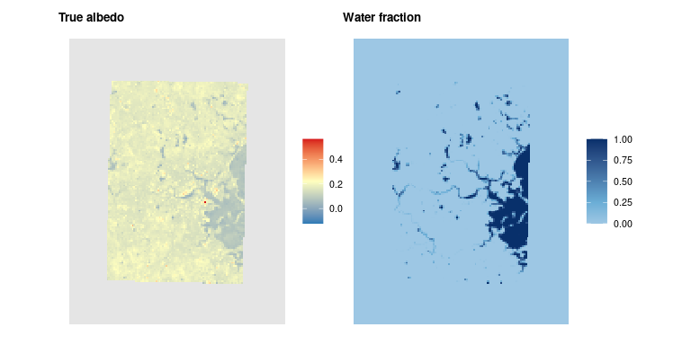
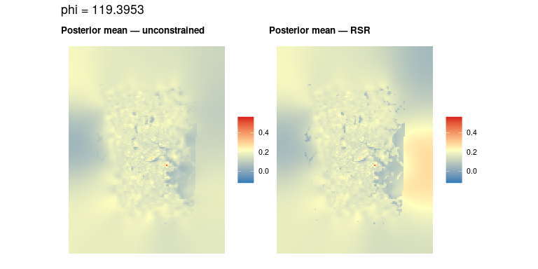
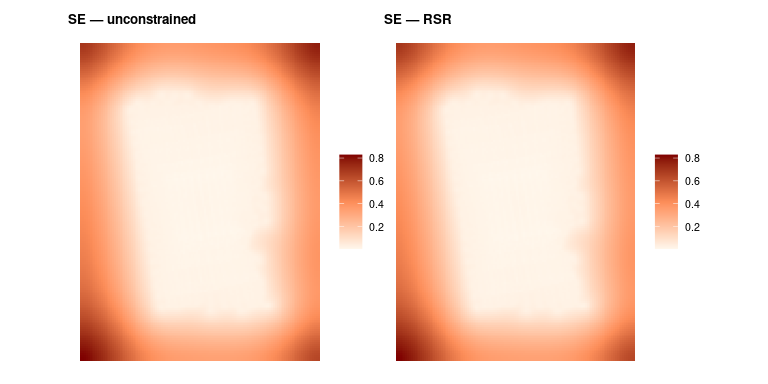
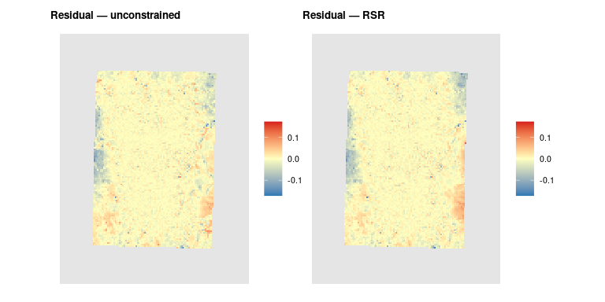
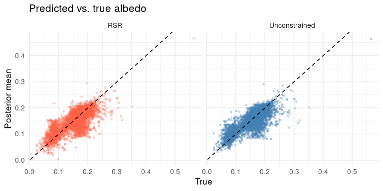
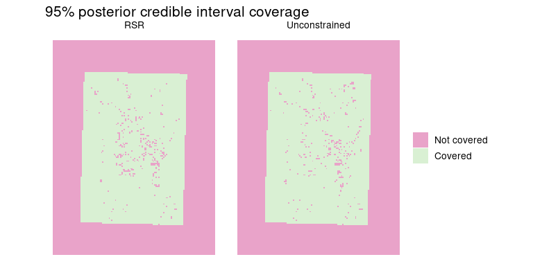

``` r
library(fastblm)
library(spatintegrate)
library(goebel2026)
library(Matrix)
library(sf)
library(ggplot2)
library(patchwork)

set.seed(42)
```

## Preview

The model fit looks like this, and in this demo we’ll build the pieces
and show how to tune parameters:

``` r
fit_aug <- fastblm::fit_fastblm(
  y      = y_alb,
  A      = A_aug,
  Q      = Q_aug,
  phi    = phi_aug,
  solver = "cholesky"
)
```

## Data

### Projected sf observations / target

``` r
# Ensures each dataset is the same projected-coordinates before computing area-intersections
soundings_proj <- spatintegrate::ensure_projected(goebel2026::soundings_augmented)
target_proj    <- spatintegrate::ensure_projected(goebel2026::target_grid)
```

### A-matrix construction using spatintegrate

``` r

A <- as(
  spatintegrate::compute_overlap_fractions(soundings_proj, target_proj),
  "dgCMatrix"
)

p <- ncol(A)
```

### Observation-vector simulation

``` r
truth <- goebel2026::target_grid$mean_albedo

# Raw upscaled
# y_alb <- goebel2026::soundings_augmented$mean_albedo +
#   rnorm(length(goebel2026::soundings_augmented$mean_albedo),
#         0, noise_sd)

# Upscale with A matrix
noise_sd <- sd(goebel2026::target_grid$mean_albedo, na.rm = TRUE) / 20

y_alb <- A %*% truth +
  rnorm(length(goebel2026::soundings_augmented$mean_albedo),
        0, noise_sd)
```

## Covariates

``` r
water_sounding <- goebel2026::soundings_augmented$proportion_water
X_fixed <- cbind(intercept = 1, water = water_sounding)
q       <- ncol(X_fixed)

water_grid_p <- goebel2026::target_grid$proportion_water
water_grid_p[is.na(water_grid_p)] <- 0

X_grid <- cbind(intercept = 1, water = water_grid_p)
```

## Intrinsic SAR Prior (ρ = 1)

Setting ρ = 1 gives an intrinsic SAR prior: Q = (I − W)ᵀ(I − W) is
positive semi-definite (singular). K_aug is still invertible because AᵀA
regularises the system in the observed directions. Because Q is singular
its log-determinant is undefined; we use `log_det_Q = 0` as a convention
(improper prior) — it is a constant that cancels out of the φ optimum.

``` r

W <- goebel2026::make_W_matrix(goebel2026::target_grid)

rho_fixed <- 1.0
IminusW   <- Matrix::Diagonal(nrow(W)) - rho_fixed * W
Q_fixed   <- Matrix::forceSymmetric(Matrix::crossprod(IminusW))
Q_fixed   <- Matrix::drop0(Q_fixed)

cat(sprintf("Q fixed at rho=1: p=%d  nnz=%d\n", nrow(Q_fixed), nnzero(Q_fixed)))
#> Q fixed at rho=1: p=21760  nnz=535096
```

## Tune φ via CV

``` r
lambda_beta <- 0.01

A_aug <- as(cbind(A, X_fixed), "dgCMatrix")

Q_aug_fun <- function(theta) {
  Q_aug     <- Matrix::bdiag(Q_fixed, lambda_beta * Matrix::Diagonal(q))
  log_det_Q <- q * log(lambda_beta)
  list(Q = Q_aug, log_det_Q = log_det_Q)
}

tuned_cv_rho1 <- tune_cv(
  y          = y_alb,
  A          = A_aug,
  Q_fun      = Q_aug_fun,
  theta_init = numeric(0), # providing theta_init will 
 # X_cov      = X_fixed,
  k          = 5L,
  verbose    = TRUE
)

# ML alternative (faster, no cross-validation):
# tuned_ml_rho1 <- tune_ml(
#   y          = y_alb,
#   A          = A_aug,
#   Q_fun      = Q_aug_fun,
#   X_fixed    = NULL,
#   theta_init = numeric(0),
#   verbose    = TRUE
# )
```

## Fit

``` r
phi_aug <- tuned_cv_rho1$phi
print(phi_aug)
#> [1] 119.3953

Q_aug <- Matrix::bdiag(
  Q_fixed,
  lambda_beta / phi_aug * Matrix::Diagonal(q)
)

fit_aug <- fastblm::fit_fastblm(
  y      = y_alb,
  A      = A_aug,
  Q      = Q_aug,
  phi    = phi_aug,
  solver = "cholesky"
)

r_hat    <- fit_aug$posterior_mean[seq_len(p)]
beta_hat <- fit_aug$posterior_mean[p + seq_len(q)]

cat(sprintf("beta_hat: intercept=%.4f  water=%.4f\n", beta_hat[1], beta_hat[2]))
#> beta_hat: intercept=-0.0000  water=-0.0314

se_aug  <- fastblm::posterior_se(fit_aug)
se_r    <- se_aug[seq_len(p)]
se_beta <- se_aug[p + seq_len(q)]

cat(sprintf("se_beta:  intercept=%.4f  water=%.4f\n", se_beta[1], se_beta[2]))
#> se_beta:  intercept=2.0839  water=0.0017

# A_pred maps [r; beta] -> r + X_grid %*% beta, i.e. full grid-level prediction
A_pred  <- as(cbind(Matrix::Diagonal(p), X_grid), "dgCMatrix")
pred    <- as.vector(A_pred %*% fit_aug$posterior_mean)
se_pred <- fastblm::posterior_se(fit_aug, A_new = A_pred)
```

## RSR Constraint

``` r
C_spatial   <- as.matrix(t(X_fixed) %*% A)
C_aug       <- cbind(C_spatial, matrix(0, q, q))

fit_aug_rsr <- fastblm::constrain(fit_aug, C_aug)

r_hat_rsr    <- fit_aug_rsr$posterior_mean[seq_len(p)]
beta_hat_rsr <- fit_aug_rsr$posterior_mean[p + seq_len(q)]

cat(sprintf("RSR beta_hat: intercept=%.4f  water=%.4f\n",
            beta_hat_rsr[1], beta_hat_rsr[2]))
#> RSR beta_hat: intercept=0.1697  water=-0.1003
cat(sprintf("RSR ||C r||_inf = %.2e\n", max(abs(C_spatial %*% r_hat_rsr))))
#> RSR ||C r||_inf = 9.89e-07

# Sanity check on C Sigma C' conditioning
SigmaCt_rsr  <- fit_aug_rsr$constraint$SigmaCt
CSigmaCt_rsr <- as.matrix(C_aug) %*% as.matrix(SigmaCt_rsr)
cat(sprintf("C Sigma C' eigenvalues: %s\n",
            paste(formatC(eigen(CSigmaCt_rsr)$values, format = "e", digits = 3),
                  collapse = ", ")))
#> C Sigma C' eigenvalues: 2.044e+08, 4.478e-02

pred_rsr    <- as.vector(A_pred %*% fit_aug_rsr$posterior_mean)
se_pred_rsr <- fastblm::posterior_se(fit_aug_rsr, A_new = A_pred)
```

## Evaluation

``` r
# Restrict to cells covered by at least one sounding footprint -- unobserved
# cells are pure prior smoothing and shouldn't count toward predictive metrics.
observed_cells <- colSums(A) > 0

eval_metrics <- function(label, pred, se, truth) {
  keep  <- observed_cells & !is.na(truth)
  resid <- pred[keep] - truth[keep]
  rmse     <- sqrt(mean(resid^2))
  r2       <- 1 - sum(resid^2) / sum((truth[keep] - mean(truth[keep]))^2)
  coverage <- mean(truth[keep] >= pred[keep] - 1.96 * se[keep] &
                   truth[keep] <= pred[keep] + 1.96 * se[keep])
  cat(sprintf("%-22s  RMSE=%.4f  R2=%.4f  95%%cov=%.1f%%  (n=%d cells)\n",
              label, rmse, r2, 100 * coverage, sum(keep)))
  data.frame(Model = label, RMSE = rmse, R2 = r2, Coverage = coverage)
}

met_base <- eval_metrics("Unconstrained",   pred,     se_pred,     truth)
#> Unconstrained           RMSE=0.0154  R2=0.7640  95%cov=96.0%  (n=7392 cells)
met_rsr  <- eval_metrics("RSR-constrained", pred_rsr, se_pred_rsr, truth)
#> RSR-constrained         RMSE=0.0144  R2=0.7915  95%cov=95.9%  (n=7392 cells)

knitr::kable(rbind(met_base, met_rsr), digits = 4, row.names = FALSE,
             col.names = c("Model", "RMSE", "R²", "95% Coverage"))
```

| Model           |   RMSE |     R² | 95% Coverage |
|:----------------|-------:|-------:|-------------:|
| Unconstrained   | 0.0154 | 0.7640 |       0.9598 |
| RSR-constrained | 0.0144 | 0.7915 |       0.9590 |

## Plots

### True field and water covariate

``` r
sf_plot(plot_sf, "truth", "True albedo", lims = lim_alb, midpt = mean(lim_alb)) |
sf_plot(plot_sf, "water", "Water fraction",
        lo = "#f7fbff", mi = "#6baed6", hi = "#08306b", midpt = 0.25)
```

<!-- -->

### Fitted fields

``` r
(sf_plot(plot_sf, "r_hat",     "Posterior mean — unconstrained",
         lims = lim_alb, midpt = mean(lim_alb)) |
 sf_plot(plot_sf, "r_hat_rsr", "Posterior mean — RSR",
         lims = lim_alb, midpt = mean(lim_alb))) +
  plot_annotation(title = sprintf("phi = %.4f", phi_aug))
```

<!-- -->

### Posterior SE

``` r
sf_plot(plot_sf, "se",    "SE — unconstrained",
        lo = "#fff7ec", mi = "#fc8d59", hi = "#7f0000",
        midpt = mean(lim_se), lims = lim_se) |
sf_plot(plot_sf, "se_rsr", "SE — RSR",
        lo = "#fff7ec", mi = "#fc8d59", hi = "#7f0000",
        midpt = mean(lim_se), lims = lim_se)
```

<!-- -->

### Residuals

``` r
sf_plot(plot_sf, "resid",     "Residual — unconstrained", lims = lim_res, midpt = 0) |
sf_plot(plot_sf, "resid_rsr", "Residual — RSR",           lims = lim_res, midpt = 0)
```

<!-- -->

### Predicted vs. true

``` r
keep  <- !is.na(truth)
sc_df <- data.frame(
  truth  = rep(truth[keep], 2),
  fitted = c(pred[keep], pred_rsr[keep]),
  model  = rep(c("Unconstrained", "RSR"), each = sum(keep))
)

ggplot(sc_df, aes(truth, fitted)) +
  geom_point(aes(colour = model), alpha = 0.3, size = 0.8) +
  geom_abline(slope = 1, intercept = 0, linetype = "dashed") +
  scale_colour_manual(values = c("Unconstrained" = "steelblue", "RSR" = "tomato"),
                      guide = "none") +
  facet_wrap(~ model) +
  labs(title = "Predicted vs. true albedo", x = "True", y = "Posterior mean") +
  theme_minimal(base_size = 13)
```

<!-- -->

### 95% coverage

``` r
cov_sf <- rbind(
  st_sf(covered = plot_sf$cov_base, model = "Unconstrained", geometry = st_geometry(plot_sf)),
  st_sf(covered = plot_sf$cov_rsr,  model = "RSR",           geometry = st_geometry(plot_sf))
)

ggplot(cov_sf) +
  geom_sf(aes(fill = covered), colour = NA) +
  scale_fill_manual(values  = c("TRUE" = "#d9f0d3", "FALSE" = "#e9a3c9"),
                    labels  = c("TRUE" = "Covered", "FALSE" = "Not covered"),
                    na.value = "grey90", name = NULL) +
  facet_wrap(~ model) +
  labs(title = "95% posterior credible interval coverage") +
  theme_void(base_size = 13)
```

<!-- -->

## Session Info

``` r
sessionInfo()
#> R version 4.4.0 (2024-04-24)
#> Platform: x86_64-pc-linux-gnu
#> Running under: AlmaLinux 8.10 (Cerulean Leopard)
#> 
#> Matrix products: default
#> BLAS/LAPACK: FlexiBLAS NETLIB;  LAPACK version 3.12.0
#> 
#> locale:
#>  [1] LC_CTYPE=en_US.UTF-8       LC_NUMERIC=C              
#>  [3] LC_TIME=en_US.UTF-8        LC_COLLATE=en_US.UTF-8    
#>  [5] LC_MONETARY=en_US.UTF-8    LC_MESSAGES=en_US.UTF-8   
#>  [7] LC_PAPER=en_US.UTF-8       LC_NAME=C                 
#>  [9] LC_ADDRESS=C               LC_TELEPHONE=C            
#> [11] LC_MEASUREMENT=en_US.UTF-8 LC_IDENTIFICATION=C       
#> 
#> time zone: America/New_York
#> tzcode source: system (glibc)
#> 
#> attached base packages:
#> [1] stats     graphics  grDevices utils     datasets  methods   base     
#> 
#> other attached packages:
#> [1] patchwork_1.2.0          ggplot2_4.0.0            sf_1.0-16               
#> [4] Matrix_1.7-0             goebel2026_0.0.0.9000    spatintegrate_0.0.0.9000
#> [7] fastblm_0.0.0.9000      
#> 
#> loaded via a namespace (and not attached):
#>  [1] s2_1.1.9           generics_0.1.4     class_7.3-22       KernSmooth_2.23-22
#>  [5] lattice_0.22-6     digest_0.6.37      magrittr_2.0.3     evaluate_1.0.3    
#>  [9] grid_4.4.0         RColorBrewer_1.1-3 fastmap_1.2.0      e1071_1.7-16      
#> [13] DBI_1.2.3          scales_1.4.0       cli_3.6.5          rlang_1.1.6       
#> [17] units_0.8-5        withr_3.0.2        yaml_2.3.10        tools_4.4.0       
#> [21] deldir_2.0-4       dplyr_1.1.4        boot_1.3-30        vctrs_0.6.5       
#> [25] R6_2.6.1           proxy_0.4-27       lifecycle_1.0.4    classInt_0.4-11   
#> [29] spdep_1.3-13       pkgconfig_2.0.3    pillar_1.10.2      gtable_0.3.6      
#> [33] glue_1.8.0         Rcpp_1.0.14        xfun_0.52          tibble_3.3.0      
#> [37] tidyselect_1.2.1   rstudioapi_0.17.1  knitr_1.50         dichromat_2.0-0.1 
#> [41] farver_2.1.2       htmltools_0.5.8.1  labeling_0.4.3     rmarkdown_2.29    
#> [45] wk_0.9.4           compiler_4.4.0     S7_0.2.0           sp_2.2-0          
#> [49] spData_2.3.4
```
